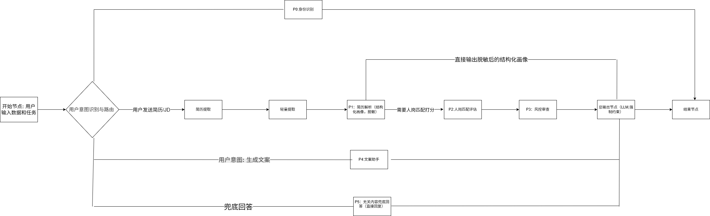
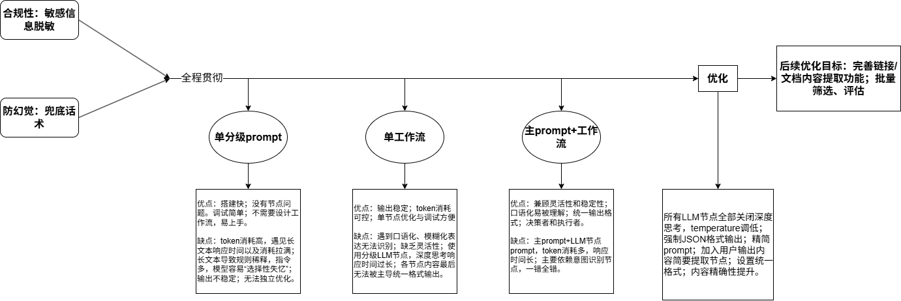

# AI招聘助手

基于大模型和工作流架构的智能化招聘初筛与评估工具，帮助HR从海量简历中快速、精准地筛选出匹配的候选人。

## 快速体验

https://www.coze.cn/store/agent/7633024086352265254?bot_id=true

## 核心功能

- 简历解析：自动提取候选人学历、技能、工作年限等关键信息并结构化输出
- 人岗匹配打分：五维度量化评估（学历/经验/技能/项目/稳定性），输出标准化研判报告
- 风控审查：识别频繁跳槽、职业断层等潜在风险，提供核实建议
- 批量处理：支持多份简历横向对比，各自独立输出完整报告

## 技术架构

采用单Agent+多工作流节点的架构设计，将招聘评估流程拆解为P1简历解析、P2人岗匹配打分、P3风控审查三个独立模块，各节点职责单一，通过JSON格式化数据传递。

## 性能优化

| 版本 |备注 |
| :--- | :--- | :--- | :--- |
| V1.0 单Prompt  | 功能验证通过，性能瓶颈明显 |
| V2.0 工作流初版 |  数据冗余+格式不受限 |
| V2.1 优化版 |JSON强约束+精简变量传递 |

## 测试验证

经过系统测试，覆盖高匹配、部分匹配、完全不匹配、批量处理、敏感信息脱敏等多种场景。

## 合规设计

- 自动脱敏：隐去姓名、电话、邮箱等隐私信息
- 反歧视约束：禁止基于性别、年龄、地域等特征的评价
- 免责声明：所有报告末尾强制附加

## 技术栈

Coze工作流 · 大语言模型 · Prompt Engineering · JSON

## 项目文档

- [分级Prompt模板库](prompt-templates.txt)
- [工作日志](Work Log.txt)
- [产品设计文档](product-design.txt)
